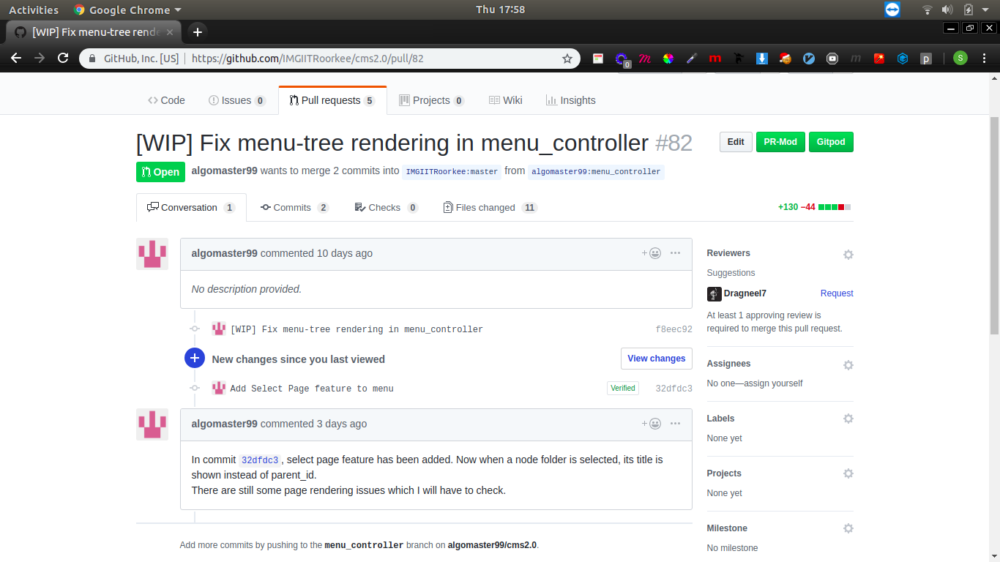
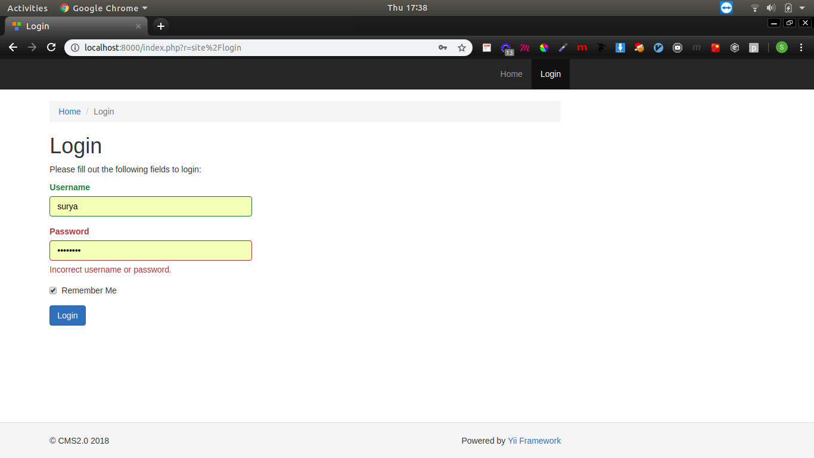

# PR-Mod

Reviewing PR's made easy.

## Description

Simplfy the process of reviewing a PR by deploying the application on a remote server.

Saves you from the trouble of setting up the development environment on your computer and makes reviewing PR's on the go easy.

Works with both private and public repositories.





## How PR-Mod works

PR-Mod works with applications that support docker based deployment. It searches for a file named `Testfile` in the reposiotry.

[What is Testfile ?](https://www.google.com)

[How to write a testfile ?](https://www.google.com)

Based on the `Testfile` PR-Mod create an independent `docker:dind` image for each application where it is sandboxed from other applications running on the server.

```python
dind_env = client.containers.run(
        'prmod/base-image',
        name=name,
        ports={'8088/tcp': 8000},
        volumes={
            vol_host: {
                'bind': volume,
                'mode': 'rw'
            }
        },
        working_dir=cwd,
        privileged=True,
        detach=True)
```

[Base Docker image used by PR-Mod.](https://hub.docker.com/u/prmod)

## Installation

Development and production also require a chrome extension using which user interacts with PR-Mod server.

* Clone the PR-Mod github repository

    `git clone https://github.com/Dragneel7/pr-mod.git`

* Install python dependencies
    
    `pip3 install -r requirements.txt`

* Run flask server

    `python3 views.py`

* Visit [localhost](http://localhost:5000)

Installation for PR-Mod Chrome extension

* Clone the PR-Mod-Chrome-Extension github repository

    `git clone https://github.com/Dragneel7/pr-mod-chrome-extension.git`

* Deploy Chrome Extension

    [Steps to deploy chrome extension](https://developer.chrome.com/webstore/publish)

## Techstack and Framework

* [Flask](https://github.com/pallets/flask)

* [GitHub v3 api](https://developer.github.com/v3/)

* [GitHub-Flask](https://github.com/cenkalti/github-flask)

* [Docker-py](https://github.com/docker/docker-py)


## Roadmap

Make PR-Mod available for non docker based reposiotries.

## Authors and acknowledgment

* [Surya Saini](https://github.com/Dragneel7/)

* [Pranjal Tale](https://github.com/pranjaltale16)

## License

MIT License